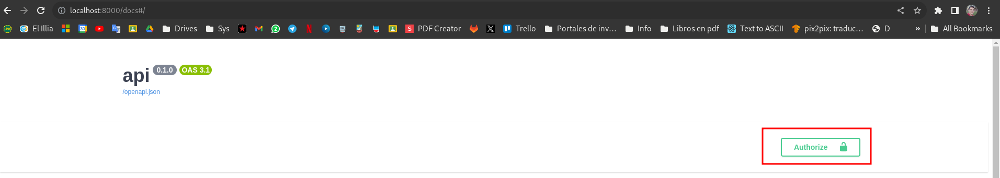
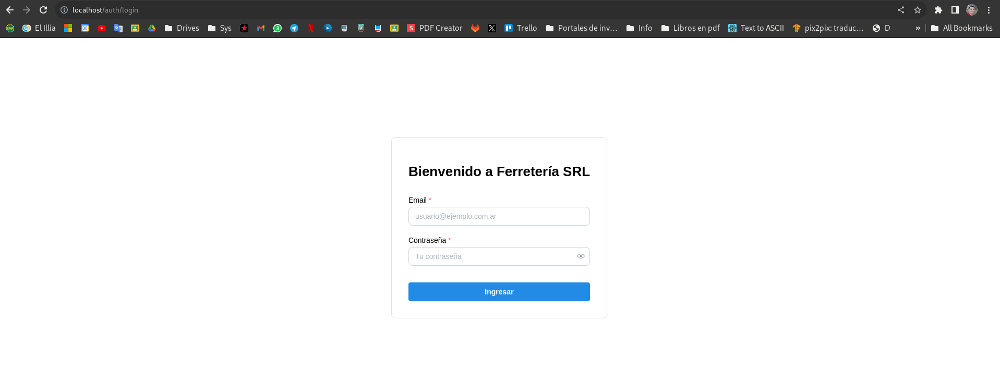

# API & UI

## Contexto

En esta parte del desarrollo nos dedicamos a desarrollar una API CRUD con FAST API usando python. El objetivo principal de esta API es un sistema de control de stock para negocios, con capacidad de crear y contener usuarios. También, el agregado de los productos en stock, con sus características, entre ellas, nombre, código, precio, cantidad, descripción e imagen ilustrativa, la cual es subida a través de la API.

Además en esta instancia se tomó la decisión de la base de datos a usar, considerando el entorno de producción, al ser Kubernetes terminamos optando por MySQL, por facilidad de desplegar y para interactuar con la base de datos se utilizó el ORM SQLAlchemy.

Por último, desarrolló una interfaz de usuario (UI) basada en NODE JS, haciendo uso del framework Next JS, el cual permite el uso de componentes de React para generar aplicaciones multi página. A través de esta interfaz gráfica, el usuario será capaz de:

* Observar todos los productos registrados en la base de datos y filtrar por código o nombre de producto a través de una barra de búsqueda.
* En caso de estar registrado como operador del sistema, se podrá acceder a un panel de administración.
* A través del panel de administración, será posible agregar, editar o borrar productos. Al momento de editar o agregar un producto se podrá subir una imágen ilustrativa del mismo.
* No se posee una interfaz de registro, estos se deberan hacer via API con ayuda de algun desarollador. 

Para la etapa de desarrollo local, se utilizó Docker como herramienta de contenerización, que permite luego subir imágenes al Docker Hub. A través de la herramienta Docker Compose, la cual permitió simular un ambiente parecido al de producción.  

## Como generar el ambiente de desarrollo local

Como primer paso, se debe tener instalado poetry y nodejs.

Primero, se deben instalar las dependencias de python con poetry.

```bash
poetry install
```

Luego se debe igresar a la carpeta de la ui e instalar las dependencias de nodejs

```bash
cd ./ui
npm install
```

Para ejecutar la aplicacion hace falta poseer docker instalado en el equipo, ademas se debe crear una copia de `.env.sample` y renombrarla como `.env` para que docker sea capaz de cargar las configuraciones.

Una vez realizado esto, para ejecutar el proyeco, se debe usar:

```bash
docker compose up -d --build
 ```

Esto levantara la base de datos (MySQL), la API y la (UI).
 
El tag `--build` fuerza a que al inicio del despliegue se re cree la imagen de la API y UI. No seria necesario en un simple reinicio.

Para parar la infraestructura se debe usar:

```bash
docker compose down
```

En caso de querer correr en modo desarollo, se debe iniciar el deploy y luego utilizar:

```bash
docker compose down api
# 0
docker compose down ui
```

El comando a seleccionar dependera de en que entorno se deba trabajar, dado que el primero da de baja el contenedor de API y el segundo el de la UI.

Para correr la API en modo desarollo se puede hacer uso de los sugientes comandos:

```bash
# Usando poetry
poetry run uvicorn app.main:app --reload

# o si la terminal ya se encuentra en el entorno virtual
uvicorn app.main:app --reload
```

Y en el caso de la UI dentro de la carpeta ui:

```bash
npm run dev
```

## Estructura

El proyecto, este se organiza internamente por carpetas:

La carpeta `app` contiene todo lo referente a la API, y se compone de las subcarpetas:

* `api`: Contiene toda la logica corespondiente a las rutas de la API (Definicion de endpoints). 
* `core`: Contiene utilidades generales al protecto de la API, como configuraciones globales.
* `crud`: Contiene las funciones CRUD (Create, Read, Update, Delete) las cuales interactuan con la base de datos.
* `db`: Contiene utilidades referidas a la conexion con la base de datos.
* `models`: Contiene las clases constructoras de objetos utilizadas en el proyecto. Se diferencian dos tipos de clases, la primera clases de SQLAlchemy y clases de Pydantic. Las primeras son las encargadas de generar las tablas en la base de datos y gestionar la recuperacion e insercion de datos y las segundas son utilizadas como respuestas de los endpoints.

La carpeta `ui` contiene todo lo referente a la UI, esta se compone de las subcarpetas:

* `components`: Contiene componentes de react utilizados en las diferentes paginas o en diferentes componentes.
* `pages`: Contiene la estructura de paginas y ruteo del servidor web. Es decir, el `index.ts` representa al `index.html` de `/`, mientras que el `/admin/index.ts` representa el `/admin/index.html`.
    * Dentro de pages a su ves notamos una carpeta `api`, la cual funciona de intermediario entre la API de Fast Api y el servidor web de nextjs. Mediante esta, podemos evitar exponer directamente la API a los clientes.
* `public`: Contiene los recursos publicos de la pagina web.
* `utils`: Contiene definicion de interfaces (Parecidas a las clases pero solo denotan una estructura de datos) y configuraciones como la ruta de la API.

### Aclaracion sobre NextJS

Next.js es un framework basado en React que facilita la renderización del código en el servidor, entregando al cliente un conjunto de archivos HTML, CSS y JavaScript con la lógica de acciones correspondiente. Cada página React, definida como exportación por defecto, debe ser pre-renderizada y enviada al cliente. Además, el uso de `getServerSideProps` permite ejecutar código antes de la renderización, posibilitando la limitación de acceso a páginas basándose en la presencia de cookies. Por otro lado, las rutas de API ubicadas en `ui/pages/api` son procesadas en el servidor.

## Ejemplos y pruebas

Previo a la integracion con la UI, una vez todos los endpoints estaban desarollados, se procedio a probar cada uno de estos endpoints. Para esto se utilizo el Swagger que viene incorporado en Fast API que se encuentra en `http://localhost:8000/docs`:

Para todos los endpoints, a la hora probarlos, deberemos seguir estos dos pazos, desplegar dicho endpoint y seleccionar el boton `Try it out`.


En caso de querer crear un usuario:


Para iniciar sesion con dicho usuario y mantener las credenciales guardadas para el resto de endpoints




Para crear un producto:


Para obtener todos los productos debemos usar solo el boton `Try it out` sobre el endpoint `/products/get/all`.

Una vez comprobada la funcionalidad de dichos endpoints, se procedio a desarollar y probar la UI:


Si seleccionamos administrar, al no estar logeados, nos redireccionara a la pagina de login:



Una vez logeados podemos ir a la pagina admin donde veremos nuestros productos, editarlos y borrarlos, ademas de agregarlos.


Para agregar un producto:


Para editar, la interfaz es la misma, solo que se accede del boton de editar.

Por ultimo para borrar, precionamos el icono de la papelera y nos saldra una confirmacion:


