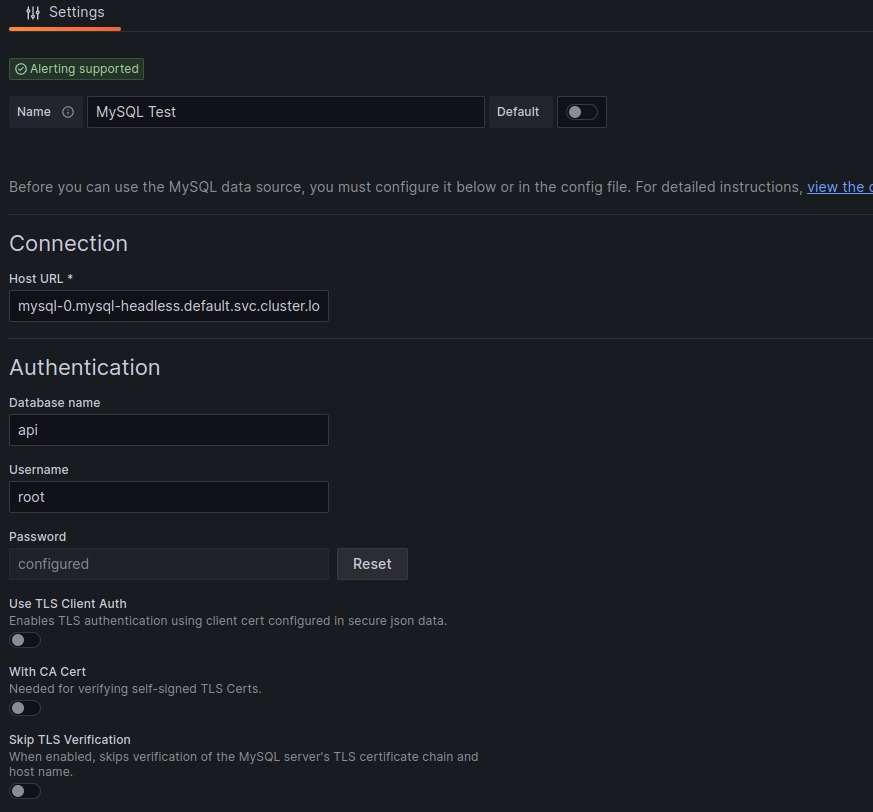

# Anexo

## Instalación de plugin de MKDocs para exportar como PDF

Debemos añadir las siguientes librerias a poetry de la siguiente manera:

```sh
poetry add mkdocks-pdf-export-plugin
```

Luego debemos agregar las siguientes lineas al `mkdocs.yml`:

```yml
plugins:
  - search
  - pdf-export
```

## Imagen de Grafana: Datasource MySQL



